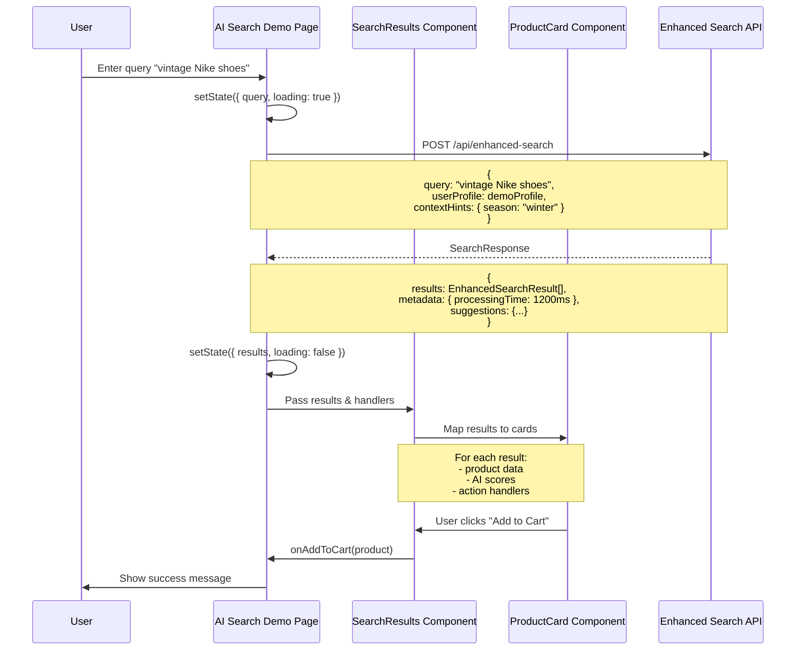
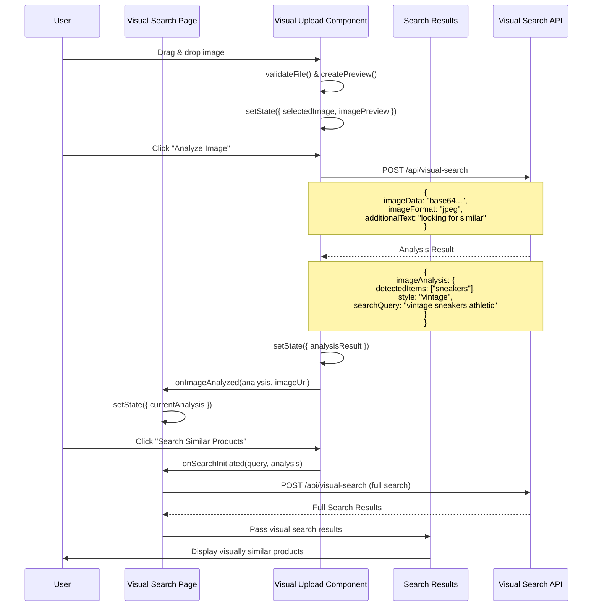
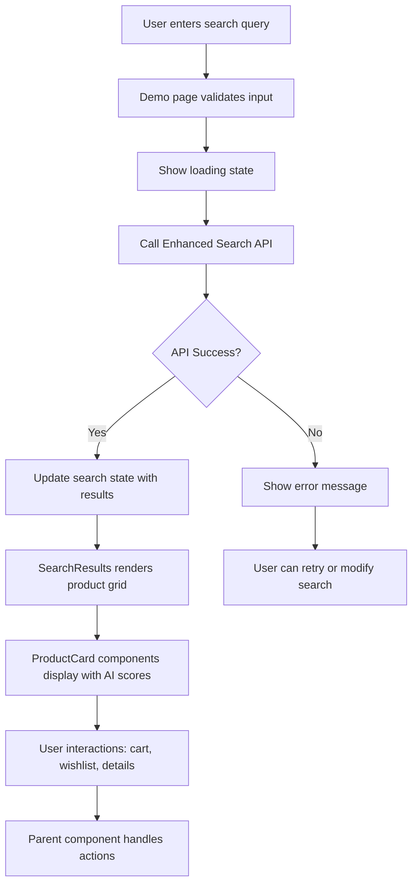
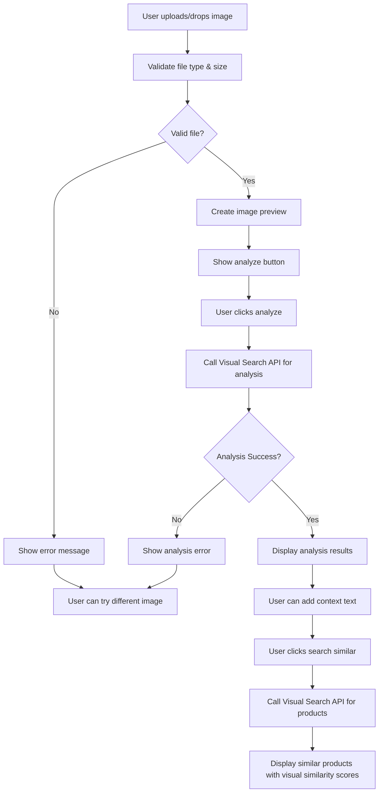

# ThriftAI Component Interaction & Data Flow

## 🎯 Frontend Component Architecture

```mermaid
graph TB
    subgraph "Pages Layer"
        HomePage["/page.tsx<br/>Landing Page"]
        DemoPage["/ai-search-demo/page.tsx<br/>AI Search Demo"]
        VisualPage["/visual-search/page.tsx<br/>Visual Search"]
    end

    subgraph "Component Layer"
        SearchResults["SearchResults.tsx<br/>- Display ranked products<br/>- Filter & sort controls<br/>- Pagination"]

        ProductCard["ProductCard.tsx<br/>- Product display<br/>- AI scores & badges<br/>- Action buttons"]

        VisualUpload["VisualSearchUpload.tsx<br/>- Image upload/drag-drop<br/>- AI analysis display<br/>- Search initiation"]
    end

    subgraph "UI Components"
        Button["Button"]
        Card["Card"]
        Badge["Badge"]
        Input["Input"]
        Alert["Alert"]
        Tabs["Tabs"]
    end

    subgraph "API Endpoints"
        EnhancedAPI["/api/enhanced-search"]
        VisualAPI["/api/visual-search"]
    end

    subgraph "State Management"
        SearchState["Search State<br/>- query<br/>- results<br/>- loading<br/>- error"]

        VisualState["Visual State<br/>- selectedImage<br/>- analysisResult<br/>- searchResults"]

        UIState["UI State<br/>- theme<br/>- filters<br/>- pagination"]
    end

    %% Page to Component relationships
    HomePage --> SearchResults
    DemoPage --> SearchResults
    VisualPage --> VisualUpload
    VisualPage --> SearchResults

    %% Component relationships
    SearchResults --> ProductCard
    SearchResults --> UI Components
    VisualUpload --> UI Components
    ProductCard --> UI Components

    %% API interactions
    DemoPage -.->|"fetch()"| EnhancedAPI
    VisualUpload -.->|"fetch()"| VisualAPI
    VisualPage -.->|"fetch()"| VisualAPI

    %% State management
    DemoPage --> SearchState
    VisualPage --> VisualState
    SearchResults --> UIState
```

## 🔄 Detailed Component Data Flow

### 1. AI Search Demo Page Flow



### 2. Visual Search Component Flow



## 📱 State Management Details

### Search State Structure
```typescript
interface SearchState {
  // Current search
  query: string
  searchResponse: SearchResponse | null
  isLoading: boolean
  error: string | null

  // Performance metrics
  searchStats: {
    processingTime: number
    confidence: number
    productsAnalyzed: number
  } | null

  // UI state
  viewMode: 'grid' | 'list'
  sortBy: 'relevance' | 'price' | 'rating' | 'sustainability'
  filters: SearchFilters
  pagination: {
    currentPage: number
    totalPages: number
  }
}
```

### Visual Search State
```typescript
interface VisualSearchState {
  // Image handling
  selectedImage: File | null
  imagePreview: string | null
  isAnalyzing: boolean

  // Analysis results
  analysisResult: ImageAnalysisResult | null
  currentAnalysis: ImageAnalysisResult | null
  currentImageUrl: string | null

  // Search results
  searchResults: SearchResponse | null
  isSearching: boolean

  // UI state
  error: string | null
  uploadProgress: number
}
```

## 🎨 Component Props & Interfaces

### SearchResults Component
```typescript
interface SearchResultsProps {
  searchResponse: SearchResponse
  onAddToCart?: (product: MockAmazonProduct) => void
  onAddToWishlist?: (product: MockAmazonProduct) => void
  onViewDetails?: (product: MockAmazonProduct) => void
  onSearchRefine?: (filters: SearchFilters) => void
  loading?: boolean
}
```

### ProductCard Component
```typescript
interface ProductCardProps {
  result: EnhancedSearchResult
  onAddToCart?: (product: MockAmazonProduct) => void
  onAddToWishlist?: (product: MockAmazonProduct) => void
  onViewDetails?: (product: MockAmazonProduct) => void
  compact?: boolean
}
```

### VisualSearchUpload Component
```typescript
interface VisualSearchUploadProps {
  onImageAnalyzed?: (analysis: ImageAnalysisResult, imageUrl: string) => void
  onSearchInitiated?: (searchQuery: string, imageAnalysis: ImageAnalysisResult) => void
  disabled?: boolean
  maxFileSizeMB?: number
}
```

## 🔄 Event Flow & User Interactions

### Text Search Flow


### Visual Search Flow


## 📊 Performance Optimizations

### Component Level Optimizations
```typescript
// Memoized product cards for better performance
const ProductCard = React.memo(({ result, onAddToCart, onAddToWishlist, onViewDetails }: ProductCardProps) => {
  // Component implementation
}, (prevProps, nextProps) => {
  // Custom comparison for optimal re-renders
  return prevProps.result.product.asin === nextProps.result.product.asin &&
         prevProps.result.ranking.finalScore === nextProps.result.ranking.finalScore
})

// Lazy loading for search results
const SearchResults = ({ searchResponse }: SearchResultsProps) => {
  const [visibleResults, setVisibleResults] = useState(12)

  // Implement virtual scrolling for large result sets
  const loadMoreResults = useCallback(() => {
    setVisibleResults(prev => prev + 12)
  }, [])
}
```

### API Call Optimizations
```typescript
// Request deduplication and caching
const useSearchQuery = (query: string) => {
  return useMemo(() => {
    if (!query.trim()) return null

    // Cache key based on query and user preferences
    const cacheKey = `search:${query}:${JSON.stringify(userProfile)}`

    // Return cached result if available and fresh
    const cached = getFromCache(cacheKey)
    if (cached && Date.now() - cached.timestamp < 300000) { // 5 minutes
      return cached.data
    }

    // Otherwise make fresh API call
    return fetchSearchResults(query)
  }, [query, userProfile])
}
```

This comprehensive component architecture ensures clean separation of concerns, optimal performance, and maintainable code structure while providing rich AI-powered functionality to users.