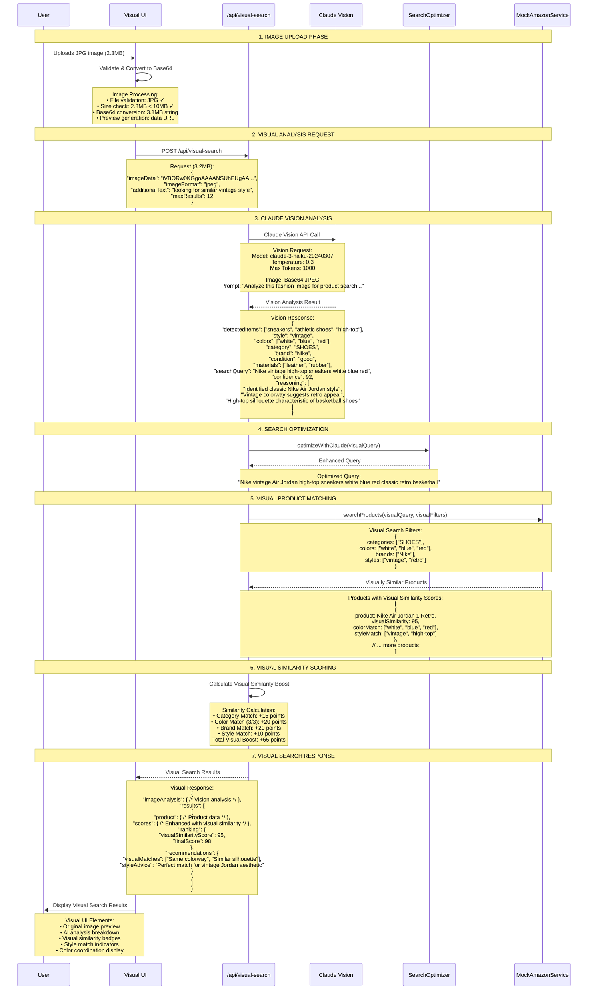

# ThriftAI Data Flow & API Specifications

## 🔍 Complete Request/Response Cycle

### Enhanced Search: Step-by-Step Data Transformation

```mermaid
sequenceDiagram
    participant U as User
    participant UI as Frontend
    participant API as /api/enhanced-search
    participant SO as SearchOptimizer
    participant CA as Claude AI
    participant MA as MockAmazonService
    participant PSE as ProductScoringEngine
    participant AAS as AIAnalysisService

    Note over U,AAS: 1. USER INPUT PHASE
    U->>UI: Enters: "vintage Nike shoes"
    UI->>UI: Validates & enriches with user context

    Note over UI,UI: Frontend State Update:<br/>{<br/>  query: "vintage Nike shoes",<br/>  loading: true,<br/>  error: null<br/>}

    Note over U,AAS: 2. API REQUEST PHASE
    UI->>API: POST /api/enhanced-search
    Note over UI,API: Request Payload:<br/>{<br/>  "query": "vintage Nike shoes",<br/>  "userProfile": {<br/>    "preferences": {<br/>      "categories": ["CLOTHING", "SHOES"],<br/>      "brands": ["Nike", "Adidas"],<br/>      "priceRange": { "min": 0, "max": 500 },<br/>      "sustainability": "high"<br/>    }<br/>  },<br/>  "contextHints": {<br/>    "season": "winter",<br/>    "occasion": "casual"<br/>  },<br/>  "clientConfig": {<br/>    "features": {<br/>      "enableAdvancedScoring": true,<br/>      "enablePersonalization": true<br/>    }<br/>  }<br/>}

    Note over U,AAS: 3. QUERY OPTIMIZATION PHASE
    API->>SO: optimizeWithClaude(query, userProfile, contextHints)
    SO->>CA: Claude API Call - Query Enhancement
    Note over SO,CA: Claude Request:<br/>Model: claude-3-haiku-20240307<br/>Temperature: 0.3<br/>Max Tokens: 1000<br/><br/>Prompt: "Optimize 'vintage Nike shoes' for thrift search..."

    CA-->>SO: Claude Response
    Note over CA,SO: Claude Response:<br/>{<br/>  "optimizedQuery": "Nike vintage sneakers athletic footwear retro classic",<br/>  "enhancements": {<br/>    "synonyms": ["footwear", "sneakers", "athletic shoes"],<br/>    "brandNormalization": ["Nike"],<br/>    "sizeExtraction": [],<br/>    "colorExtraction": [],<br/>    "intentClassification": "buy",<br/>    "budgetInference": null,<br/>    "styleInference": ["vintage", "retro"],<br/>    "categoryInference": ["SHOES"]<br/>  },<br/>  "confidence": 87,<br/>  "reasoning": "Enhanced with synonyms and style terms"<br/>}

    SO-->>API: QueryOptimization Result

    Note over U,AAS: 4. PRODUCT DISCOVERY PHASE
    API->>MA: searchProducts(optimizedQuery, filters, limit)
    Note over API,MA: Search Parameters:<br/>{<br/>  query: "Nike vintage sneakers athletic footwear retro classic",<br/>  filters: {<br/>    categories: ["SHOES"],<br/>    brands: ["Nike"],<br/>    priceRange: { min: 0, max: 500 }<br/>  },<br/>  limit: 24<br/>}

    MA-->>API: MockAmazonProduct[]
    Note over MA,API: Product Array (12 items):<br/>[<br/>  {<br/>    "asin": "B08XYZ123",<br/>    "title": "Nike Vintage Air Force 1 Classic White Sneakers",<br/>    "brand": "Nike",<br/>    "category": "SHOES",<br/>    "price": {<br/>      "current": 89.99,<br/>      "original": 120.00,<br/>      "discountPercentage": 25<br/>    },<br/>    "reviews": {<br/>      "rating": 4.3,<br/>      "count": 156<br/>    },<br/>    "sustainability": {<br/>      "ecoFriendly": true,<br/>      "recyclable": true<br/>    }<br/>  },<br/>  // ... 11 more products<br/>]

    Note over U,AAS: 5. AI ANALYSIS PHASE (Parallel Processing)
    loop For each product (parallel)
        par
            API->>PSE: scoreProduct(product, query, userProfile)
            PSE->>PSE: Calculate 100+ scoring parameters
            Note over PSE,PSE: Scoring Breakdown:<br/>• Quality Score: 85/100<br/>  - Material Quality: 80<br/>  - Brand Reputation: 95<br/>  - Durability: 82<br/>• Value Score: 78/100<br/>  - Price Comparison: 85<br/>  - Quality-to-Price: 75<br/>• Sustainability Score: 92/100<br/>  - Environmental Impact: 95<br/>  - Material Sustainability: 90<br/>• Relevance Score: 89/100<br/>  - Query Match: 95<br/>  - Semantic Similarity: 85
            PSE-->>API: ProductScores
        and
            API->>AAS: analyzeProduct(product, userProfile)
            AAS->>CA: Claude API Call - Product Analysis
            Note over AAS,CA: Analysis Prompt:<br/>"Analyze Nike Air Force 1 for thrift buyer..."
            CA-->>AAS: Product Analysis
            Note over CA,AAS: Analysis Response:<br/>{<br/>  "deepInsights": {<br/>    "productSummary": "Classic Nike sneaker with vintage appeal",<br/>    "strengths": ["Iconic design", "Durable construction", "Great value"],<br/>    "weaknesses": ["Common style", "Limited uniqueness"],<br/>    "bestUseCase": "Casual everyday wear",<br/>    "valueProposition": "Reliable classic with sustainable savings"<br/>  },<br/>  "recommendations": {<br/>    "buyingAdvice": "Excellent choice for vintage Nike collectors",<br/>    "styleAdvice": "Pairs well with casual and streetwear"<br/>  }<br/>}
            AAS-->>API: AIProductAnalysis
        end
    end

    Note over U,AAS: 6. RANKING & PERSONALIZATION PHASE
    API->>API: Calculate Final Scores & Rankings
    Note over API,API: Ranking Algorithm:<br/>1. Base Score: 85 (overall)<br/>2. Relevance Boost: +15 (query match)<br/>3. Personalization: +8 (user preferences)<br/>4. Sustainability Bonus: +5 (eco-friendly)<br/>Final Score: 113 → capped at 100

    Note over U,AAS: 7. RESPONSE ASSEMBLY PHASE
    API->>API: Assemble SearchResponse
    API-->>UI: Complete Search Response
    Note over API,UI: Response Payload (2.1KB):<br/>{<br/>  "query": {<br/>    "original": "vintage Nike shoes",<br/>    "optimized": "Nike vintage sneakers athletic footwear retro classic",<br/>    "enhancements": { /* Claude enhancements */ }<br/>  },<br/>  "results": [<br/>    {<br/>      "product": { /* Product data */ },<br/>      "scores": {<br/>        "overall": 100,<br/>        "breakdown": {<br/>          "quality": { "score": 85, "factors": {...} },<br/>          "value": { "score": 78, "factors": {...} },<br/>          "sustainability": { "score": 92, "factors": {...} }<br/>        },<br/>        "confidence": 89,<br/>        "reasoning": ["Strong brand reputation", "Great sustainability score"]<br/>      },<br/>      "ranking": {<br/>        "position": 1,<br/>        "finalScore": 100,<br/>        "personalizedScore": 108<br/>      },<br/>      "recommendations": {<br/>        "buyingAdvice": "Excellent choice for vintage collectors"<br/>      }<br/>    }<br/>  ],<br/>  "metadata": {<br/>    "totalFound": 12,<br/>    "processingTime": 1847,<br/>    "confidence": 87,<br/>    "requestId": "req_abc123"<br/>  }<br/>}

    Note over U,AAS: 8. UI RENDERING PHASE
    UI->>UI: Update Component State
    Note over UI,UI: State Update:<br/>{<br/>  searchResponse: SearchResponse,<br/>  loading: false,<br/>  searchStats: {<br/>    processingTime: 1847,<br/>    confidence: 87,<br/>    productsAnalyzed: 12<br/>  }<br/>}

    UI->>U: Display Enhanced Results
    Note over UI,U: UI Elements Rendered:<br/>• Query optimization display<br/>• 12 product cards with AI scores<br/>• Performance metrics<br/>• Filter suggestions<br/>• Sustainability badges
```



## 🖼️ Visual Search: Complete Data Pipeline



## 📊 Performance Metrics & Monitoring

### Request Performance Tracking
```typescript
interface PerformanceMetrics {
  requestId: string
  startTime: number
  checkpoints: {
    validation_complete: number        // ~5ms
    query_optimization_complete: number // ~800ms (Claude API)
    product_search_complete: number    // ~150ms
    ai_processing_complete: number     // ~1200ms (parallel scoring)
    ranking_complete: number          // ~50ms
    suggestions_complete: number       // ~30ms
    response_serialization: number     // ~10ms
  }
  totalTime: number                   // ~2245ms
  claudeApiCalls: number             // 2 (optimization + analysis)
  productsScoredCount: number        // 12
  cacheHits: number                  // 0 (cold request)
  memoryUsage: number               // 45MB peak
}
```

### Error Tracking & Fallbacks
```typescript
interface ErrorHandling {
  // Claude API Failures
  claudeTimeout: {
    fallback: "basic keyword matching",
    degradedExperience: true,
    timeoutMs: 15000
  }

  // Rate Limiting
  rateLimitExceeded: {
    fallback: "cached results + basic scoring",
    retryAfter: 60,
    errorCode: "RATE_LIMIT_EXCEEDED"
  }

  // Image Processing Failures
  visionApiError: {
    fallback: "text-based search from additionalText",
    partialExperience: true,
    analysisConfidence: 30
  }

  // Service Degradation
  partialServiceFailure: {
    action: "continue with available services",
    userNotification: "Some AI features temporarily unavailable",
    gracefulDegradation: true
  }
}
```

## 🔄 Data Caching Strategy

### Response Caching Layers
```typescript
interface CachingStrategy {
  // Client-side (Browser)
  browserCache: {
    searchResults: "5 minutes",
    productImages: "1 hour",
    userPreferences: "24 hours"
  }

  // Server-side (Planned)
  redisCache: {
    claudeOptimizations: "1 hour",
    productScores: "30 minutes",
    popularSearches: "6 hours"
  }

  // CDN (Planned)
  cdnCache: {
    staticAssets: "7 days",
    productImages: "24 hours",
    apiDocumentation: "1 hour"
  }
}
```

This comprehensive data flow specification shows exactly how data moves through the ThriftAI system, from user input to final rendered results, with all transformations, API calls, and performance characteristics clearly documented.