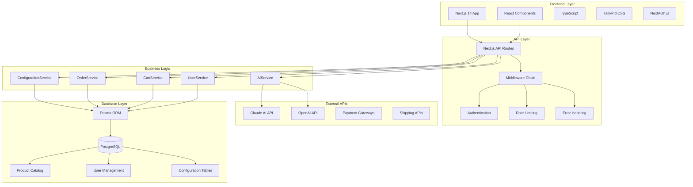
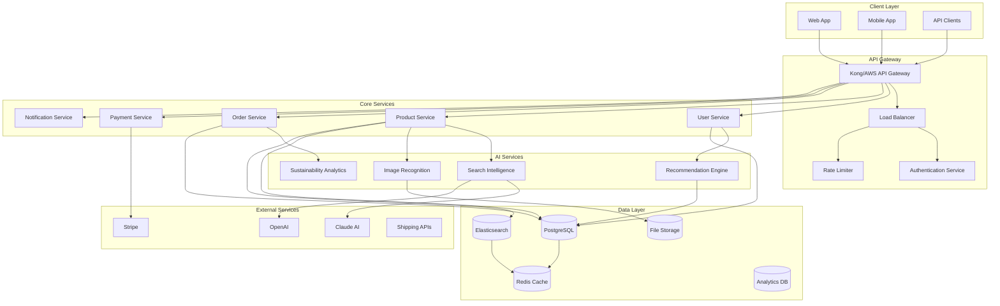
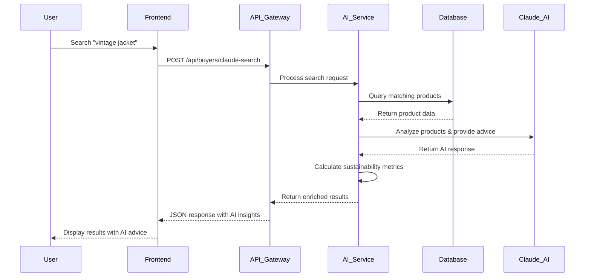
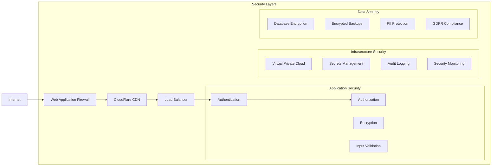
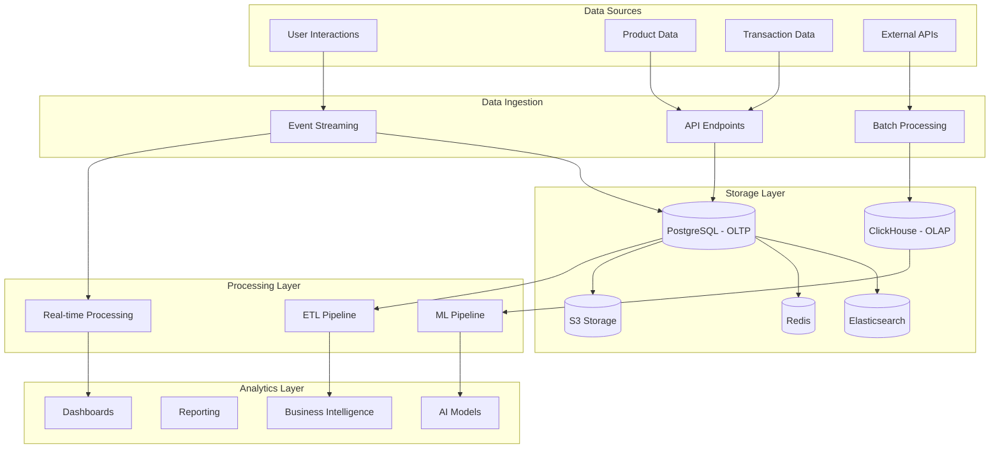
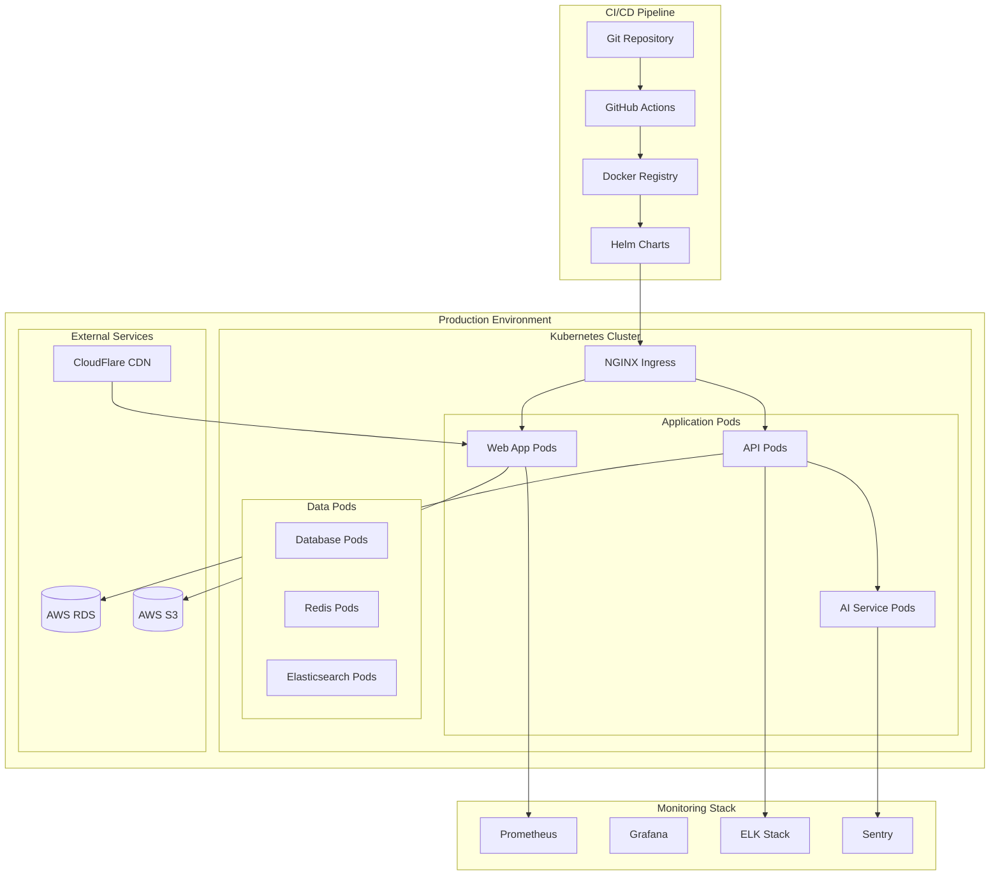
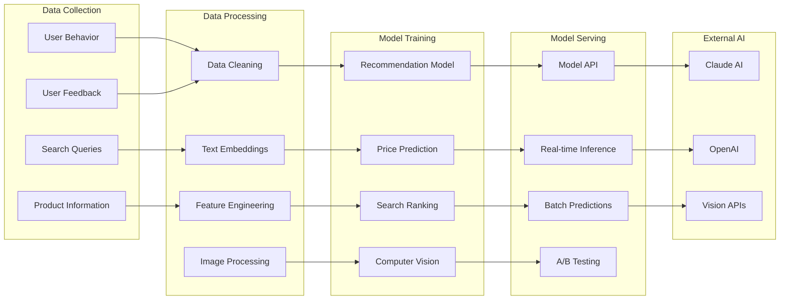
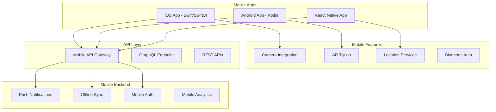

# ThriftAI - Technical Architecture Diagrams

## 🏗️ **Current System Architecture**

## 🚀 **Enhanced Microservices Architecture**

## 🔄 **Data Flow Architecture**

## 🛡️ **Security Architecture**

## 📊 **Data Architecture**

## 🌐 **Deployment Architecture**

## 🤖 **AI/ML Pipeline Architecture**

## 📱 **Mobile Architecture**

---

## 📋 **Implementation Checklist**

### **Phase 1: Foundation (Current)**
- [x] Next.js 14 with TypeScript
- [x] PostgreSQL database setup
- [x] Prisma ORM integration
- [x] Claude AI SDK integration
- [x] Basic authentication (NextAuth.js)
- [x] Product catalog and search
- [x] Responsive UI with Tailwind CSS

### **Phase 2: Enhancement (Next 30 days)**
- [ ] Database optimization and indexing
- [ ] Redis caching implementation
- [ ] Enhanced error handling and monitoring
- [ ] API rate limiting
- [ ] Security audit and fixes
- [ ] Performance optimization

### **Phase 3: Scaling (Next 90 days)**
- [ ] Microservices architecture
- [ ] Elasticsearch for advanced search
- [ ] Container orchestration (Docker + Kubernetes)
- [ ] CI/CD pipeline setup
- [ ] Load balancing and auto-scaling
- [ ] Comprehensive monitoring stack

### **Phase 4: Advanced Features (Next 180 days)**
- [ ] Computer vision integration
- [ ] Advanced recommendation engine
- [ ] Mobile app development
- [ ] AR/VR features
- [ ] Blockchain integration
- [ ] Multi-region deployment

---

This technical architecture provides a comprehensive roadmap for scaling ThriftAI from the current monolithic Next.js application to a distributed, cloud-native platform capable of handling millions of users while maintaining performance, security, and sustainability focus.