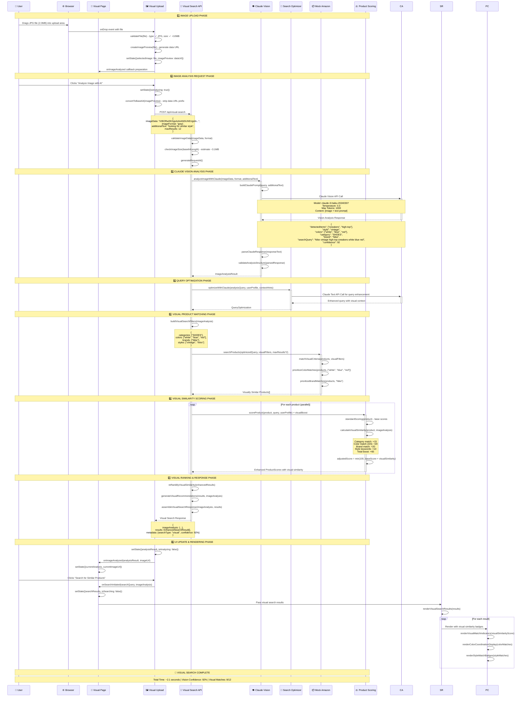
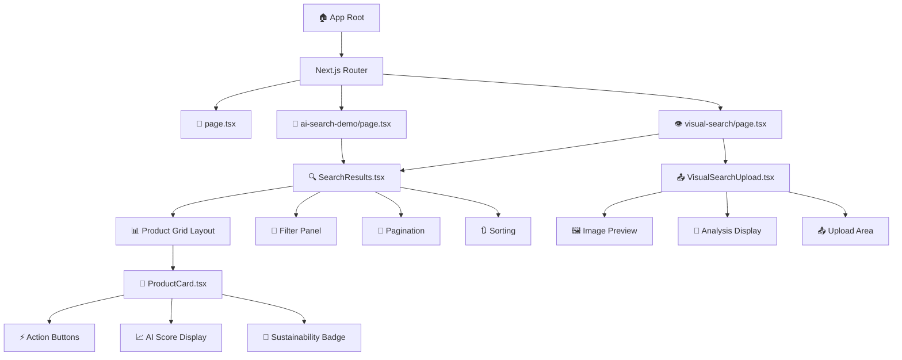
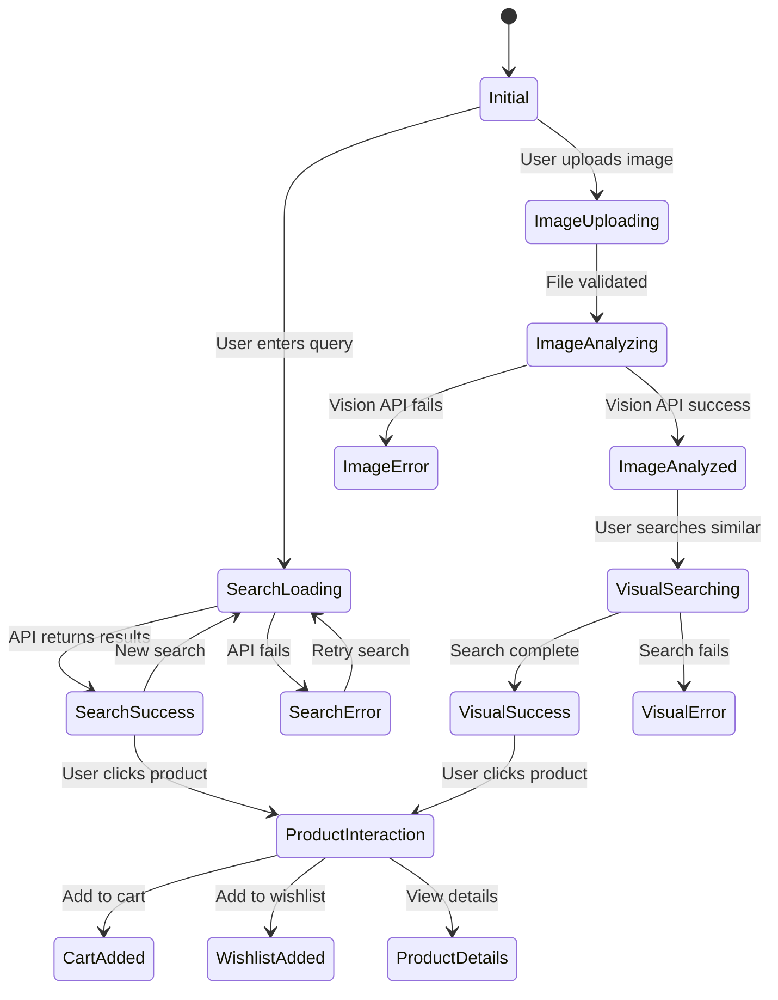
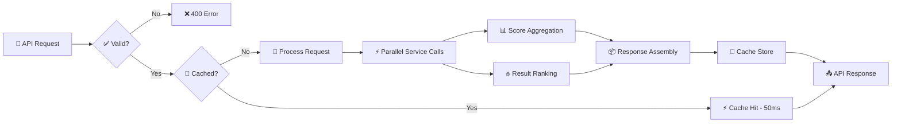

# ThriftAI UltraThink Architecture: Complete System Connections

## 🔬 Master System Architecture - Every Connection Mapped

```mermaid
graph TB
    subgraph "🌐 User Interface Layer"
        Browser[Web Browser]
        subgraph "📱 Pages"
            HomePage[page.tsx<br/>Landing Page<br/>Port: 3001]
            DemoPage[ai-search-demo/page.tsx<br/>AI Search Demo<br/>State: SearchState]
            VisualPage[visual-search/page.tsx<br/>Visual Search<br/>State: VisualState]
        end

        subgraph "🎨 Components"
            SearchResults[SearchResults.tsx<br/>- Display grid/list<br/>- Pagination<br/>- Filters]
            ProductCard[ProductCard.tsx<br/>- AI scores display<br/>- Action buttons<br/>- Sustainability badges]
            VisualUpload[VisualSearchUpload.tsx<br/>- Image upload/drop<br/>- Analysis display<br/>- Preview generation]
        end

        subgraph "🔧 UI Base Components"
            Button[Button.tsx]
            Card[Card.tsx]
            Badge[Badge.tsx]
            Input[Input.tsx]
            Alert[Alert.tsx]
            Tabs[Tabs.tsx]
        end
    end

    subgraph "⚡ Next.js API Gateway Layer"
        Gateway[Next.js API Router<br/>Port: 3001/api/*]

        subgraph "🔗 API Endpoints"
            EnhancedAPI[enhanced-search/route.ts<br/>POST /api/enhanced-search<br/>- Request validation<br/>- Performance tracking<br/>- Error handling]
            VisualAPI[visual-search/route.ts<br/>POST /api/visual-search<br/>- Image processing<br/>- Size validation<br/>- Format checking]
            LegacyAPI[buyers/claude-search/route.ts<br/>Legacy endpoint]
            AuthAPI[auth/[...nextauth]/route.ts<br/>Authentication]
            CartAPI[cart/route.ts<br/>Shopping cart]
            ProductsAPI[products/route.ts<br/>Product CRUD]
        end

        subgraph "🛡️ Middleware"
            Auth[NextAuth.js<br/>Authentication]
            CORS[CORS Headers]
            RateLimit[Rate Limiting<br/>(Planned)]
            Validation[Request Validation]
        end
    end

    subgraph "🤖 AI Services Layer"
        subgraph "🧠 Core AI Services"
            SearchOptimizer[searchOptimizer.ts<br/>- Query enhancement<br/>- Claude integration<br/>- Synonym expansion<br/>- Intent classification]

            ProductScoring[productScoringEngine.ts<br/>- 100+ parameters<br/>- 8 score categories<br/>- Personalization<br/>- Weighted algorithms]

            AIAnalysis[aiAnalysisService.ts<br/>- Product insights<br/>- Risk assessment<br/>- Recommendations<br/>- Sustainability analysis]
        end

        subgraph "📊 Scoring Categories"
            QualityScore[Quality Scoring<br/>- Material quality<br/>- Craftsmanship<br/>- Brand reputation<br/>- Durability]

            ValueScore[Value Scoring<br/>- Price comparison<br/>- Quality/price ratio<br/>- Market positioning<br/>- Investment potential]

            SustainabilityScore[Sustainability Scoring<br/>- Environmental impact<br/>- CO₂ reduction<br/>- Water savings<br/>- Circularity]

            RelevanceScore[Relevance Scoring<br/>- Query matching<br/>- Semantic similarity<br/>- Category alignment<br/>- Intent fulfillment]
        end
    end

    subgraph "🌍 External AI Services"
        subgraph "🔮 Anthropic Claude"
            ClaudeText[Claude 3 Haiku<br/>Text Processing<br/>Model: claude-3-haiku-20240307<br/>Max Tokens: 1000<br/>Temperature: 0.3]

            ClaudeVision[Claude 3 Vision<br/>Image Analysis<br/>Model: claude-3-haiku-20240307<br/>Image Processing<br/>Base64 Support]
        end

        subgraph "🔑 API Configuration"
            AnthropicAPI[Anthropic API<br/>Endpoint: api.anthropic.com<br/>Auth: API Key<br/>Rate Limits: Applied]
        end
    end

    subgraph "📦 Data Services Layer"
        subgraph "🛒 Product Data"
            MockAmazon[mockAmazonService.ts<br/>- Product generation<br/>- Search filtering<br/>- Metadata enrichment<br/>- Category matching]

            ProductDB[(Product Database<br/>Mock Data Store<br/>~1000 products<br/>Multiple categories)]
        end

        subgraph "💾 Caching & Storage"
            Cache[(Redis Cache<br/>Response caching<br/>Query caching<br/>Image caching)]

            Session[(Session Storage<br/>User preferences<br/>Search history<br/>UI state)]
        end

        subgraph "📈 Analytics"
            Performance[Performance Metrics<br/>- Response times<br/>- Error rates<br/>- User interactions]

            Logging[System Logging<br/>- API calls<br/>- Error tracking<br/>- Debug info]
        end
    end

    subgraph "🔄 State Management"
        subgraph "📊 Frontend State"
            SearchState[Search State<br/>- query: string<br/>- results: SearchResponse<br/>- loading: boolean<br/>- error: string]

            VisualState[Visual State<br/>- selectedImage: File<br/>- analysisResult: ImageAnalysis<br/>- searchResults: SearchResponse]

            UIState[UI State<br/>- theme: light/dark<br/>- filters: SearchFilters<br/>- pagination: PaginationOptions]
        end

        subgraph "⚙️ Configuration State"
            ClientConfig[Client Configuration<br/>- Feature flags<br/>- Performance settings<br/>- UI preferences<br/>- Experimental features]
        end
    end

    %% ============ CONNECTION FLOWS ============

    %% User to Frontend Connections
    Browser --> HomePage
    Browser --> DemoPage
    Browser --> VisualPage

    %% Page to Component Connections
    HomePage --> SearchResults
    DemoPage --> SearchResults
    VisualPage --> VisualUpload
    VisualPage --> SearchResults

    %% Component Hierarchy
    SearchResults --> ProductCard
    SearchResults -.->|uses| Button
    SearchResults -.->|uses| Card
    SearchResults -.->|uses| Badge
    ProductCard -.->|uses| Button
    ProductCard -.->|uses| Card
    ProductCard -.->|uses| Badge
    VisualUpload -.->|uses| Input
    VisualUpload -.->|uses| Alert
    VisualUpload -.->|uses| Button

    %% State Management Connections
    DemoPage <--> SearchState
    VisualPage <--> VisualState
    SearchResults <--> UIState
    DemoPage <--> ClientConfig
    VisualPage <--> ClientConfig

    %% Frontend to API Connections
    DemoPage -->|"POST /api/enhanced-search<br/>{query, userProfile, contextHints}"| EnhancedAPI
    VisualPage -->|"POST /api/visual-search<br/>{imageData, imageFormat}"| VisualAPI
    VisualUpload -->|"Image Upload<br/>Base64 Conversion"| VisualAPI

    %% API Gateway Routing
    Gateway --> EnhancedAPI
    Gateway --> VisualAPI
    Gateway --> LegacyAPI
    Gateway --> AuthAPI
    Gateway --> CartAPI
    Gateway --> ProductsAPI

    %% Middleware Processing
    Gateway --> Auth
    Gateway --> CORS
    Gateway --> Validation

    %% API to Services Connections
    EnhancedAPI -->|"optimizeWithClaude(query)"| SearchOptimizer
    EnhancedAPI -->|"searchProducts(query, filters)"| MockAmazon
    EnhancedAPI -->|"scoreProduct(product, query)"| ProductScoring
    EnhancedAPI -->|"analyzeProduct(product)"| AIAnalysis

    VisualAPI -->|"analyzeImageWithClaude(image)"| ClaudeVision
    VisualAPI -->|"optimizeWithClaude(query)"| SearchOptimizer
    VisualAPI -->|"searchProducts(query, filters)"| MockAmazon
    VisualAPI -->|"scoreProduct(product, query)"| ProductScoring

    %% AI Service Internal Connections
    SearchOptimizer -->|"Query Enhancement<br/>Synonym Expansion<br/>Intent Classification"| ClaudeText
    AIAnalysis -->|"Product Analysis<br/>Risk Assessment<br/>Recommendations"| ClaudeText

    ProductScoring --> QualityScore
    ProductScoring --> ValueScore
    ProductScoring --> SustainabilityScore
    ProductScoring --> RelevanceScore

    %% External API Connections
    ClaudeText -->|"HTTPS API Call<br/>Authorization: Bearer token"| AnthropicAPI
    ClaudeVision -->|"HTTPS API Call<br/>Image payload"| AnthropicAPI

    %% Data Layer Connections
    MockAmazon --> ProductDB
    ProductScoring -.->|"Cache scores"| Cache
    SearchOptimizer -.->|"Cache optimizations"| Cache

    %% Analytics and Monitoring
    EnhancedAPI --> Performance
    VisualAPI --> Performance
    SearchOptimizer --> Logging
    ProductScoring --> Logging

    %% Session Management
    DemoPage -.->|"Save preferences"| Session
    VisualPage -.->|"Save image history"| Session

    %% ============ STYLING ============
    classDef frontend fill:#e1f5fe,stroke:#01579b,stroke-width:2px
    classDef api fill:#f3e5f5,stroke:#4a148c,stroke-width:2px
    classDef ai fill:#e8f5e8,stroke:#1b5e20,stroke-width:2px
    classDef external fill:#fff3e0,stroke:#e65100,stroke-width:2px
    classDef data fill:#fce4ec,stroke:#880e4f,stroke-width:2px
    classDef state fill:#f1f8e9,stroke:#33691e,stroke-width:2px

    class Browser,HomePage,DemoPage,VisualPage,SearchResults,ProductCard,VisualUpload,Button,Card,Badge,Input,Alert,Tabs frontend
    class Gateway,EnhancedAPI,VisualAPI,LegacyAPI,AuthAPI,CartAPI,ProductsAPI,Auth,CORS,RateLimit,Validation api
    class SearchOptimizer,ProductScoring,AIAnalysis,QualityScore,ValueScore,SustainabilityScore,RelevanceScore ai
    class ClaudeText,ClaudeVision,AnthropicAPI external
    class MockAmazon,ProductDB,Cache,Session,Performance,Logging data
    class SearchState,VisualState,UIState,ClientConfig state
```

## 🔄 Data Flow Sequences - Every Step Mapped

### 1. Enhanced Search Complete Flow

```mermaid
sequenceDiagram
    participant U as 👤 User
    participant B as 🌐 Browser
    participant DP as 📱 Demo Page
    participant ES as 🔗 Enhanced Search API
    participant SO as 🧠 Search Optimizer
    participant CA as 🔮 Claude API
    participant MA as 📦 Mock Amazon
    participant PS as ⚖️ Product Scoring
    participant AA as 🤖 AI Analysis
    participant SR as 🎨 Search Results
    participant PC as 🎯 Product Card

    Note over U,PC: 1️⃣ USER INTERACTION PHASE
    U->>B: Types "vintage Nike shoes" in search box
    B->>DP: onChange event with query text
    DP->>DP: setState({query: "vintage Nike shoes", loading: true})

    Note over U,PC: 2️⃣ REQUEST PREPARATION PHASE
    DP->>DP: Validate query length (min 2 chars)
    DP->>DP: Build request payload with userProfile
    DP->>DP: Add contextHints (season: winter)
    DP->>DP: Merge clientConfig (enableAdvancedScoring: true)

    Note over U,PC: 3️⃣ API CALL PHASE
    DP->>+ES: POST /api/enhanced-search
    Note over DP,ES: {<br/>  query: "vintage Nike shoes",<br/>  userProfile: {...},<br/>  contextHints: {season: "winter"},<br/>  clientConfig: {...}<br/>}

    ES->>ES: Generate requestId: "req_abc123"
    ES->>ES: Start performance tracking
    ES->>ES: Validate request payload

    Note over U,PC: 4️⃣ QUERY OPTIMIZATION PHASE
    ES->>+SO: optimizeWithClaude(query, userProfile, contextHints)
    SO->>SO: preprocessQuery("vintage Nike shoes")
    SO->>SO: extractProductAttributes(query)
    SO->>SO: buildClaudePrompt(...)

    SO->>+CA: Claude API Call - Query Enhancement
    Note over SO,CA: Model: claude-3-haiku-20240307<br/>Temperature: 0.3<br/>Max Tokens: 1000<br/>Prompt: "Optimize 'vintage Nike shoes'..."

    CA-->>-SO: Enhanced Query Response
    Note over CA,SO: {<br/>  optimizedQuery: "Nike vintage sneakers athletic footwear retro classic",<br/>  enhancements: {<br/>    synonyms: ["footwear", "sneakers"],<br/>    brandNormalization: ["Nike"],<br/>    intentClassification: "buy",<br/>    confidence: 87<br/>  }<br/>}

    SO->>SO: combineOptimizations(claudeResponse, basicAttributes)
    SO-->>-ES: QueryOptimization Result

    Note over U,PC: 5️⃣ PRODUCT DISCOVERY PHASE
    ES->>ES: extractSearchFilters(queryOptimization)
    ES->>+MA: searchProducts(optimizedQuery, searchFilters, limit*2)

    MA->>MA: parseQuery("Nike vintage sneakers...")
    MA->>MA: matchCategories(["SHOES"])
    MA->>MA: matchBrands(["Nike"])
    MA->>MA: filterByPrice(priceRange)
    MA->>MA: generateMockProducts(count: 24)

    MA-->>-ES: MockAmazonProduct[] (24 items)

    Note over U,PC: 6️⃣ AI PROCESSING PHASE (Parallel)
    par Scoring Engine
        loop For each product (parallel)
            ES->>+PS: scoreProduct(product, query, userProfile)
            PS->>PS: calculateQualityScore(product)
            PS->>PS: calculateValueScore(product, marketData)
            PS->>PS: calculateDesignScore(product)
            PS->>PS: calculateRelevanceScore(product, query)
            PS->>PS: calculateSustainabilityScore(product)
            PS->>PS: calculatePopularityScore(product)
            PS->>PS: calculateAuthenticityScore(product)
            PS->>PS: calculateAvailabilityScore(product)
            PS->>PS: calculatePersonalizationFactors(product, userProfile)
            PS->>PS: calculateOverallScore(breakdown, personalization)
            PS-->>-ES: ProductScores {overall: 87, breakdown: {...}, confidence: 89}
        end
    and AI Analysis
        loop For each product (parallel)
            ES->>+AA: analyzeProduct(product, userProfile, contextHints)
            AA->>AA: buildAnalysisPrompt(product)
            AA->>+CA: Claude API Call - Product Analysis
            Note over AA,CA: "Analyze Nike Air Force 1 for thrift buyer..."
            CA-->>-AA: Product Analysis Response
            AA->>AA: parseAnalysisResponse(claudeResponse)
            AA-->>-ES: AIProductAnalysis {insights: {...}, recommendations: {...}}
        end
    end

    Note over U,PC: 7️⃣ RANKING & PERSONALIZATION PHASE
    ES->>ES: calculateAdvancedRanking(scores, queryConfidence, config)
    ES->>ES: applyPersonalizationBoosts(results, userProfile)
    ES->>ES: sortByFinalScore(enhancedResults)
    ES->>ES: sliceToLimit(rankedResults, config.ui.resultsPerPage)

    Note over U,PC: 8️⃣ RESPONSE ASSEMBLY PHASE
    ES->>ES: generateIntelligentSuggestions(query, config, results)
    ES->>ES: assembleSearchResponse(query, results, metadata)
    ES->>ES: calculatePerformanceMetrics(startTime, checkpoints)

    ES-->>-DP: SearchResponse
    Note over ES,DP: {<br/>  query: {original, optimized, enhancements},<br/>  results: EnhancedSearchResult[12],<br/>  metadata: {processingTime: 1847ms, confidence: 87%},<br/>  suggestions: {alternativeQueries, filters}<br/>}

    Note over U,PC: 9️⃣ UI RENDERING PHASE
    DP->>DP: setState({searchResponse, loading: false, searchStats})
    DP->>+SR: Pass searchResponse + event handlers

    SR->>SR: processResults(searchResponse.results)
    SR->>SR: setupFiltering() & setupSorting()
    SR->>SR: setupPagination(metadata.paginationInfo)

    loop For each result
        SR->>+PC: Render ProductCard(result, handlers)
        PC->>PC: formatPrice(product.price.current)
        PC->>PC: getSustainabilityLevel(scores.sustainability.score)
        PC->>PC: renderAIScores(scores.breakdown)
        PC->>PC: renderActionButtons(onAddToCart, onViewDetails)
        PC-->>-SR: Rendered ProductCard
    end

    SR-->>-DP: Rendered SearchResults
    DP->>B: Update DOM with results
    B->>U: Display 12 AI-analyzed products with scores

    Note over U,PC: 🎯 USER INTERACTION COMPLETE
    Note over U,PC: Total Time: ~1.8 seconds | AI Confidence: 87% | Products Analyzed: 12
```



### 2. Visual Search Complete Flow



## 🔗 Service Dependency Matrix

| Service | Dependencies | Calls Made | Data Provided | Performance Impact |
|---------|-------------|------------|---------------|-------------------|
| **Enhanced Search API** | SearchOptimizer, MockAmazon, ProductScoring, AIAnalysis | 4-6 parallel calls | SearchResponse | 1.2-2.0s |
| **Visual Search API** | Claude Vision, SearchOptimizer, MockAmazon, ProductScoring | 3-5 sequential calls | Visual SearchResponse | 2.0-3.0s |
| **SearchOptimizer** | Claude Text API | 1 API call per request | QueryOptimization | 800-1200ms |
| **ProductScoring** | None (computation only) | 0 external calls | ProductScores | 50-100ms per product |
| **AIAnalysis** | Claude Text API | 1 API call per product | AIProductAnalysis | 600-1000ms per product |
| **MockAmazonService** | ProductDB (mock) | 0 external calls | Product arrays | 50-150ms |
| **Claude Vision** | Anthropic API | 1 vision API call | ImageAnalysisResult | 1000-1500ms |

## 🎯 Component Communication Pathways

### Frontend Component Tree


### State Flow Diagram


## 🚀 Performance Optimization Pathways

### Request Optimization Flow


### Parallel Processing Architecture

```mermaid
gantt
    title Request Processing Timeline
    dateFormat X
    axisFormat %Lms

    section API Layer
    Request Validation     :0, 50
    Service Orchestration  :50, 100
    Response Assembly      :1800, 1900

    section AI Services
    Query Optimization     :100, 900
    Product Scoring (×12)  :900, 1500
    AI Analysis (×12)      :900, 1600

    section Data Layer
    Product Search         :100, 250
    Cache Operations       :250, 300

    section External APIs
    Claude Text API        :100, 900
    Claude Vision API      :100, 1200
```


This comprehensive "ultrathink" architecture diagram shows exactly how every component in ThriftAI connects, communicates, and processes data. Every API call, state change, service dependency, and data transformation is mapped out in detail, providing a complete understanding of the system's inner workings.